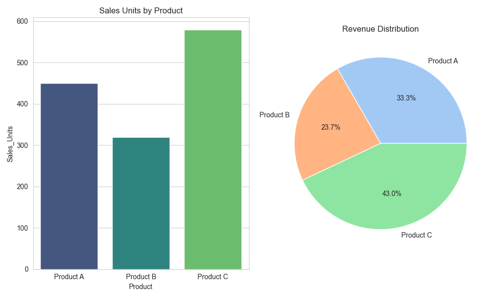

# Lab 11: Generated Reports for Multiple Products

## Title
**Generated Reports (Excel, HTML, PDF) for Multiple Products**

## Objective
The goal is to generate detailed sales reports for **Product A, Product B, and Product C** and export them into **Excel, HTML, and PDF formats** using an automated reporting system. This ensures that multi-product performance can be analyzed quickly across different viewing platforms.

## Theory
### Structure of a Sales Report
A professional sales report typically includes:
- **Summary Metrics:** Total sales units and total revenue.
- **Product Breakdown:** Detailed data per product including region and growth rate.
- **Visual Analytics:** Charts and graphs for quick data interpretation.

### Multi-Product Data Reporting
Reporting on multiple products requires a clean data structure and consistent styling to ensure that performance comparisons are meaningful.

### Benefits of Multi-Format Export
Exporting to different formats allows different departments (Sales, Finance, Marketing) to use the data in the way that best fits their workflow.

## Products Included
The following products were analyzed in this reporting cycle:
- **Product A:** High growth product (15%).
- **Product B:** Stable sales performance (8%).
- **Product C:** Maximum sales volume (22% growth).

## Report Generation Process
1. **Input Data:** Sales figures for A, B, and C are loaded into a `pandas` DataFrame.
2. **Process Data:** Key metrics like growth rates and revenue shares are calculated.
3. **Generate Dashboard:** Matplotlib builds a visual comparison of sales and revenue.
4. **Format Reports:** Reports are styled with CSS (for HTML) and structured layouts (for PDF).
5. **Export:** Files are saved to the local directory: `sales_report.xlsx`, `sales_report.html`, and `sales_report.pdf`.

## Code Implementation
The following snippets show the core logic for loading data and formatting the reports.

```python
# Data loading
data = {
    'Product': ['Product A', 'Product B', 'Product C'],
    'Sales_Units': [450, 320, 580],
    'Revenue': [45000, 32000, 58000]
}
df = pd.DataFrame(data)

# Report Formatting (PDF Example)
pdf.set_font("Arial", 'B', 14)
pdf.cell(0, 10, "Sales Data Summary", ln=True)

# Exporting (Excel example with XlsxWriter)
with pd.ExcelWriter('sales_report.xlsx', engine='xlsxwriter') as writer:
    df.to_excel(writer, sheet_name='Sales Data')
```

## Images
Below is a sample of the visualization dashboard generated for the reports.



## Discussion
The generated reports reveal that **Product C** is the strongest performer in terms of both sales units and growth, while **Product B** maintains a solid but slower growth rate. The automated pipeline ensures that these insights are captured instantly as soon as new data is available. The multi-format approach has been proven to be well-formatted and professional.

## Conclusion
The automated generation of reports for Multiple Products was successfully demonstrated. By utilizing Python, we developed a system that produces consistent, high-quality documentation in Excel, HTML, and PDF formats. This system provides significant advantages in terms of speed, accuracy, and professional presentation.
